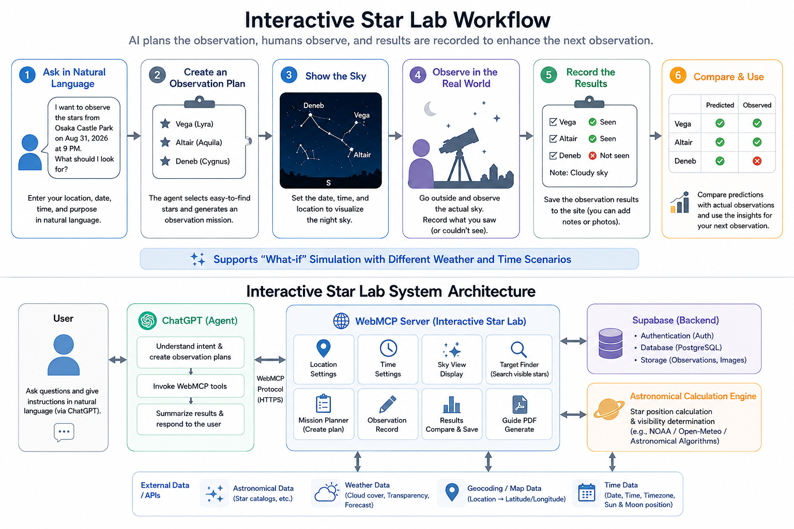

# Interactive Star Lab

**A WebMCP-powered stargazing guide that turns natural-language intent into an actionable observation workflow.**

Tell an Agent where and when you want to observe. Interactive Star Lab configures the sky, predicts visible stars, creates an Observation Mission, records what you actually saw, and compares the results with its predictions. The same application also works as a standalone manual sky viewer without WebMCP.

[Live Demo](https://interactive-star-lab.vercel.app) · [Demo Video](https://youtu.be/A5fB2o8e4Dk) · [Devpost Story](https://devpost.com/software/interactive-star-lab)



_The diagram shows the overall agent-assisted workflow. Location lookup may be handled by the Agent; direct weather, cloud-cover, and moonlight integrations are planned future work._

## Why WebMCP?

Traditional astronomy software asks users to translate a simple goal into coordinates, time zones, viewing directions, and visibility settings. Interactive Star Lab exposes its deterministic astronomy and observation workflow through WebMCP, allowing an Agent to translate requests such as “Show me New York’s sky at 9 PM” into application operations.

Actions performed by an Agent and actions performed manually share the same React state and astronomy calculations. A sky configured through WebMCP is immediately visible and editable in the browser; Missions, results, Snapshots, and Guides remain available to the human observer.

## Highlights

- Configure a location, local time, and open Sky with one `configure_sky_view` call.
- Use WebMCP to query the sky, create Missions, save results, capture Snapshots, and generate Guides.
- Explore the sky from any latitude and longitude.
- Change observation date and time, direction, altitude, and field of view.
- Toggle stars, star names, constellation lines, and constellation names.
- Inspect individual stars and the Sun.
- Simulate daylight, twilight, light pollution, and observer sensitivity.
- Run What-if experiments and compare before/after sky views.
- Create Observation Missions with immutable creation-time predictions.
- Record Visible, Not Visible, or Unsure results and compare them with predictions.
- Restore a Mission on another device with a one-time Recovery Code.
- Save deterministic sky Snapshots and generate printable Observation Guides and PDFs.
- Open Sky in an Agent-assisted full-canvas view with a compact Agent Activity overlay, or switch to the existing Manual controls.

## Local setup

Requirements: Node.js 18 or newer and npm.

```bash
npm ci
npm run dev
```

Open the URL printed by Vite, usually <http://localhost:5173/>.

## Optional Supabase persistence

Set these Vite public environment variables to persist Missions, observation results, and Mission-linked sky Snapshots in Supabase:

```bash
VITE_SUPABASE_URL=https://your-project.supabase.co
VITE_SUPABASE_ANON_KEY=your-anon-or-publishable-key
```

Apply the migrations in [`supabase/migrations`](supabase/migrations), enable Anonymous Sign-Ins in Supabase Authentication, and configure the Vercel environment variables for each deployed environment. The application creates an anonymous session automatically. When a Mission is created, its Recovery Code is shown once and can later be entered in History or passed to the `restore_observation_mission` WebMCP tool.

Recovery Codes are not stored in plaintext. A Mission ID alone cannot restore a Mission from another device. If Supabase is unavailable or not configured, the application continues in local LocalStorage / IndexedDB mode.

Never put a Supabase `service_role` key in browser code or Vercel client-side environment variables.

## WebMCP demo flow

1. Call `configure_sky_view` with a built-in place preset or custom coordinates, an IANA time zone, and the desired local date and time. This configures the viewer and opens Sky in one operation.
2. Call `predict_visible_stars` to find suitable targets, then `create_observation_plan` to create a Mission. Store the one-time Recovery Code securely.
3. Review the Mission on Plan, inspect the configured Sky, or call `open_observe_view` to begin recording observations.
4. In Observe, record Visible, Not Visible, or Unsure for each target, then save the results with `save_observation_results`.
5. Call `get_observation_results` or `compare_prediction_and_observation` to compare the Mission prediction with the real observation.
6. Optionally call `capture_sky_snapshot` to archive the rendered Sky or `generate_observation_guide` to create a printable guide and PDF.

For example, an Agent can configure New York City at 9 PM local time with:

```json
{
  "preset": "new-york",
  "localDateTime": "2026-09-03T21:00"
}
```

For a place that is not built in, replace `preset` with a `site` object containing `name`, `latitude`, `longitude`, and `timeZone`.

## Verification

```bash
npm run build
npm run verify
npm run verify:layout
```

`build` runs strict TypeScript checks and the production Vite build. `verify` runs deterministic astronomy, observation, Guide, Snapshot, cloud, and WebMCP checks. `verify:layout` runs the optional browser layout walkthrough when Playwright and Chromium are available. The verification suite includes an English-only scan over tracked files and `dist/`.

## Catalogs and regeneration

- `src/data/constellations.json`: English constellation names, descriptions, and line endpoints.
- `src/data/stars.json`: star coordinates, magnitudes, names, and constellation memberships.
- `data-source/stellarium-western-constellationship.v0.15.0.txt`: Stellarium Western skyculture v0.15.0 constellation lines.
- `data-source/stellarium-western-star-names.v0.15.0.txt`: Stellarium HIP identifiers and star names.
- `data-source/hipparcos-line-stars.v0.15.0.tsv`: Hipparcos line-endpoint coordinates and V magnitudes.

Regenerate the checked-in application catalogs with:

```bash
npm run import:constellations
```

## Project layout

```text
src/                 React application and domain logic
  astronomy/         Coordinates, projection, visibility, and twilight
  components/        Sky canvas and workflow screens
  data/              English star and constellation catalogs
  guides/            Observation Guide and PDF generation
  mcp/               WebMCP contracts and tools
  observation/       Mission and observation workflows
  state/              React providers and application state
scripts/             Verification and catalog generation scripts
data-source/         Checked-in source catalogs
supabase/migrations/ Database schema and RLS migrations
```

## License

This project is licensed under the [MIT License](LICENSE).
