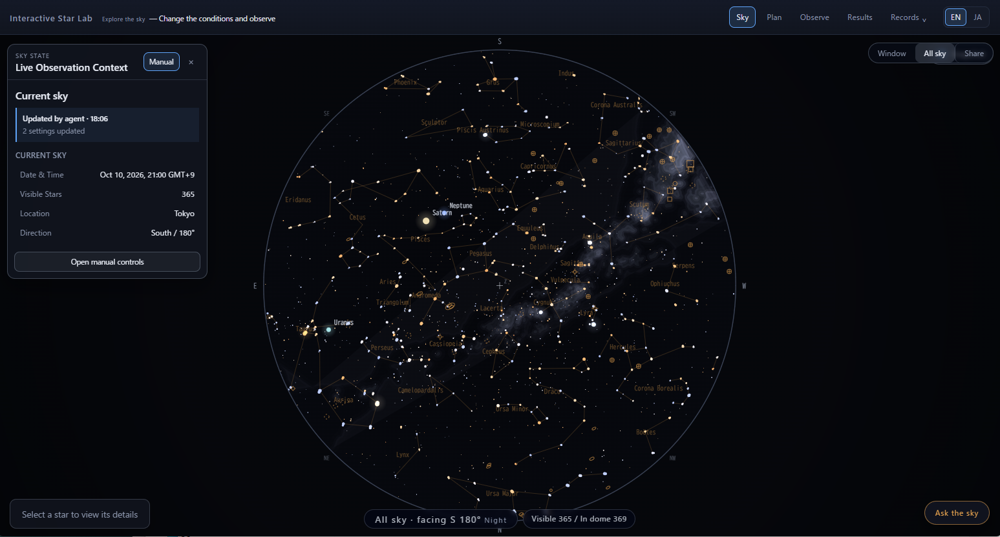
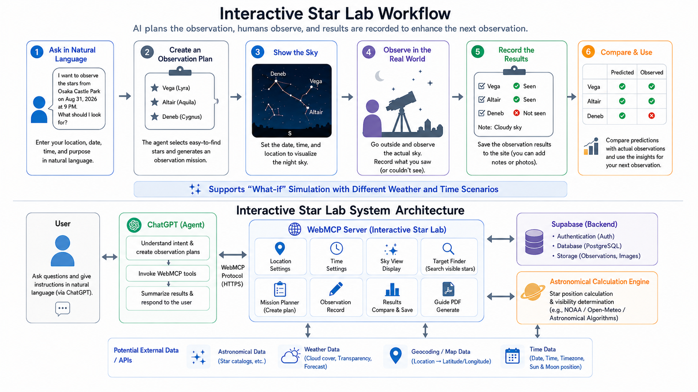

# Interactive Star Lab

**A WebMCP-powered stargazing guide with a built-in consultation agent that turns natural-language intent into an actionable observation workflow.**

Tell the agent where and when you want to observe — “Tonight in Tokyo, show me 3 bright stars.” Interactive Star Lab configures the sky in front of you, predicts visible stars, and stages an Observation Mission for you to confirm. The same tools are exposed through WebMCP for external agents, and the app also works as a standalone manual sky viewer.

[Live Demo](https://main.d35b3q1a0wz0ef.amplifyapp.com) · [Demo Video](https://youtu.be/A5fB2o8e4Dk) · [Devpost Story](https://devpost.com/software/interactive-star-lab)



_The all-sky dome after “Tonight in Tokyo, show me 3 bright stars”: the agent configured the site and 21:00 local time (see “Updated by agent” in the sidebar) while the Milky Way, planets, and constellations render live. The “Ask the sky” dock sits bottom-right._



_The diagram shows the overall agent-assisted workflow. Location lookup may be handled by the Agent; weather and cloud-cover forecasts are available through the Open-Meteo tools._

## Why WebMCP?

Traditional astronomy software asks users to translate a simple goal into coordinates, time zones, viewing directions, and visibility settings. Interactive Star Lab exposes its deterministic astronomy and observation workflow through WebMCP, allowing an Agent to translate requests such as “Show me New York’s sky at 9 PM” into application operations.

Actions performed by an Agent and actions performed manually share the same React state and astronomy calculations. A sky configured through WebMCP is immediately visible and editable in the browser; Missions, results, Snapshots, and Guides remain available to the human observer.

## Highlights

- **Ask the sky**: a floating consultation panel (Amazon Bedrock) turns requests like “Tonight in Tokyo, show me 3 bright stars” into a configured sky, picked candidates, and a Mission — the sky moves as you discuss it, and an “Open the Plan screen” chip hands the transition to you.
- **Two agent doors, one engine**: the in-app agent and external WebMCP clients drive the same tool registry; navigation and commits stay gated so the human keeps control.
- Whole-sky dome map plus the windowed observation view, shareable as `#sky=` URLs.
- Milky Way contours, B-V star colors, Moon phases, planets, and 110 Messier objects.
- Night ephemeris and `rank_nights` best-night scoring; Open-Meteo cloud/seeing forecasts with dark-site comparison.
- Human-in-the-loop planning: `propose_plan` → `commit_proposal` proposals, stale-plan detection, confirm/undo tokens for destructive operations.
- Observation Missions with immutable creation-time predictions; record Visible, Not Visible, or Unsure and compare against predictions.
- ICS/CSV export, printable Observation Guides and PDFs, deterministic sky Snapshots.
- Restore a Mission on another device with a one-time Recovery Code (optional Supabase persistence).
- English/Japanese UI toggle.
- Simulate daylight, twilight, light pollution, and observer sensitivity; run What-if comparisons.

## Local setup

Requirements: Node.js 18 or newer and npm.

```bash
npm ci
npm run dev
```

Open the URL printed by Vite, usually <http://localhost:5173/>.

## Optional Supabase persistence

Set these Vite public environment variables to persist Missions, observation results, and Mission-linked sky Snapshots in Supabase:

```bash
VITE_SUPABASE_URL=https://your-project.supabase.co
VITE_SUPABASE_ANON_KEY=your-anon-or-publishable-key
```

Apply the migrations in [`supabase/migrations`](supabase/migrations), enable Anonymous Sign-Ins in Supabase Authentication, and configure the Vercel environment variables for each deployed environment. The application creates an anonymous session automatically. When a Mission is created, its Recovery Code is shown once and can later be entered in History or passed to the `restore_observation_mission` WebMCP tool.

Recovery Codes are not stored in plaintext. A Mission ID alone cannot restore a Mission from another device. If Supabase is unavailable or not configured, the application continues in local LocalStorage / IndexedDB mode.

Never put a Supabase `service_role` key in browser code or Vercel client-side environment variables.

## WebMCP demo flow

1. Call `configure_sky_view` with a built-in place preset or custom coordinates, an IANA time zone, and the desired local date and time. This configures the viewer and opens Sky in one operation.
2. Call `predict_visible_stars` to find suitable targets, then `create_observation_plan` to create a Mission. Store the one-time Recovery Code securely.
3. Review the Mission on Plan, inspect the configured Sky, or call `open_observe_view` to begin recording observations.
4. In Observe, record Visible, Not Visible, or Unsure for each target, then save the results with `save_observation_results`.
5. Call `get_observation_results` or `compare_prediction_and_observation` to compare the Mission prediction with the real observation.
6. Optionally call `capture_sky_snapshot` to archive the rendered Sky or `generate_observation_guide` to create a printable guide and PDF.

For example, an Agent can configure New York City at 9 PM local time with:

```json
{
  "preset": "new-york",
  "localDateTime": "2026-09-03T21:00"
}
```

For a place that is not built in, replace `preset` with a `site` object containing `name`, `latitude`, `longitude`, and `timeZone`.

For a human-in-the-loop variant, `propose_plan` stages a draft instead of creating a Mission directly; the human accepts or rejects items and `commit_proposal` materializes the accepted subset.

## Consultation agent (optional)

The “Ask the sky” tab in the floating dock posts the conversation to an AWS Lambda proxy ([`lambda/consult-agent.mjs`](lambda/consult-agent.mjs)) that calls the Amazon Bedrock Converse API. Tool calls are executed locally in the browser against the same registry WebMCP exposes, so proposals, Missions, and sky state stay consistent regardless of which door the agent came through.

```bash
VITE_AGENT_API_URL=https://your-lambda-function-url/
```

The Lambda function needs permission to call `bedrock:Converse` on the chosen model — `AGENT_MODEL_ID`, default `amazon.nova-lite-v1:0`. When `VITE_AGENT_API_URL` is unset the consult tab stays hidden and the app remains fully usable.

## Verification

```bash
npm run build
npm run verify
npm run verify:layout
```

`build` runs strict TypeScript checks and the production Vite build. `verify` runs deterministic astronomy, observation, Guide, Snapshot, cloud, and WebMCP checks. `verify:layout` runs the optional browser layout walkthrough when Playwright and Chromium are available. The verification suite includes an English-only scan over tracked files and `dist/`.

## Catalogs and regeneration

- `src/data/constellations.json`: English constellation names, descriptions, and line endpoints.
- `src/data/stars.json`: star coordinates, magnitudes, names, and constellation memberships.
- `data-source/stellarium-western-constellationship.v0.15.0.txt`: Stellarium Western skyculture v0.15.0 constellation lines.
- `data-source/stellarium-western-star-names.v0.15.0.txt`: Stellarium HIP identifiers and star names.
- `data-source/hipparcos-line-stars.v0.15.0.tsv`: Hipparcos line-endpoint coordinates and V magnitudes.

Regenerate the checked-in application catalogs with:

```bash
npm run import:constellations
```

## Project layout

```text
src/                 React application and domain logic
  agent/             Consultation loop, tool selection, Lambda client
  astronomy/         Coordinates, projection, visibility, and twilight
  components/        Sky canvas, workflow screens, agent dock
  data/              English star and constellation catalogs
  guides/            Observation Guide and PDF generation
  i18n/              Typed English/Japanese message dictionaries
  mcp/               WebMCP contracts and tools
  observation/       Mission and observation workflows
  proposals/         Proposal staging model
  state/              React providers and application state
  weather/           Open-Meteo client and forecast interpretation
lambda/              Bedrock Converse proxy for the consultation agent
scripts/             Verification and catalog generation scripts
data-source/         Checked-in source catalogs
supabase/migrations/ Database schema and RLS migrations
```

## License

This project is licensed under the [MIT License](LICENSE).
